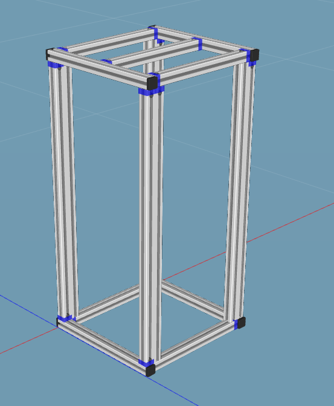
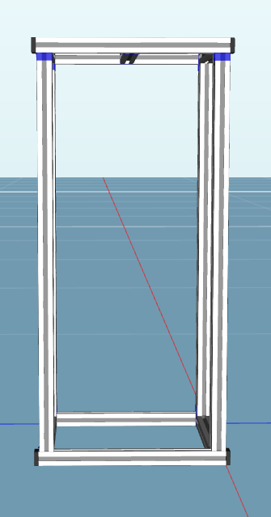
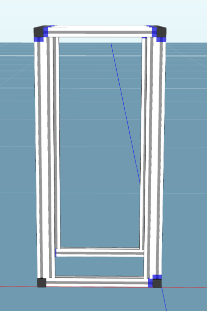
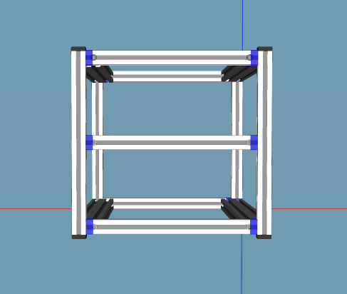
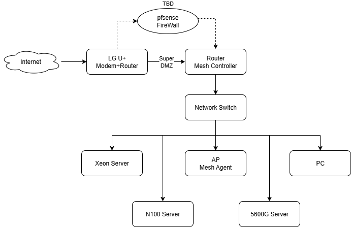

# HomeServerProject  
본 프로젝트는 개인적으로 사용할 수 있는 서비스를 직접 구현하기 위해 미니pc에서의 서버 구축에서 시작함.  
NAS의 필요로 N5105 ITX 보드를 구매했으나 우연히 서버용 MATX와 E5-2620 v3(6C12T)를 얻게 되었고, 부족한 코어 수를 늘려 NAS를 포함한 가상화 서버 구축으로 방향을 틂.  
이후 늘어난 하드웨어를 효율적으로 배치하기 위해 기존 선반을 제거하고 제대로 된 서버랙 구축 계획을 세움.  
**자세한 기술 선택 및 의사 결정 과정 ([DECISIONS.md](./DECISIONS.md))**  
※ 본 프로젝트는 2025.07.11의 [DiscordBot](https://github.com/Kang-Junhui/DiscordBot)개발을 시작일로 잡습니다.  
## 프로젝트 개요(Overview)  
- 프로젝트 기간: 2025.07.11 - 진행 중
- 주요 목표
  - 여러 하드웨어를 통한 CPU바운드 프로젝트와 메모리바운드 프로젝트의 분리
  - 각 하드웨어간 통신을 위한 최대 2.5G 내부망 구축
  - 도커를 이용한 서비스 운영 환경 구축  
- 최근 빌드 로그
  - **2025.08.20:** 알루미늄 서버탭 구매
  - **2025.08.21:** Arc A380 구매
  - **2025.08.24:** 프로젝트 Repository 생성
  - **전체 빌드 로그 ([BUILD_LOG.md](./BUILD_LOG.md))**
## 기술 스택(Tech Stack)  
#### 하드웨어
- CPU바운드 미니pc 서버
  - CPU: Ryzen5 5600G  
  - M/B: Asrock X300-stx
  - RAM: Klevv DDR4 so-dimm 64GB(32GBx2)
  - Storage: Crucial MX500 1TB  
  - Case: Asrock DeskMini x300  
- 메모리바운드 자작서버  
  - CPU: Xeon E5-2697 v4  
  - M/B: 雲星 MATX-CS612 plus  
  - RAM: Hynix DDR4 2133P ECC/REG 128GB(32GBx4)  
  - Storage
    - Samsung PM9A1 1TB(proxmox 설치 및 VM OS 설치)
    - WD HC DC550 14TB(NAS 패스스루)
    - Crucial MX500 1TB(NAS 패스스루)
    - 향후 추가 예정  
  - GPU: Intel Arc A380(AV1 En/Decoder)  
  - PSU: Micronics Classic II FullChange 750W 80Plus Gold ATX 3.1
  - Case: ABKO ncore ICARUS
- 오디오 스트리밍용 미니pc  
  - Model/CPU: Chatreey T9 N100 Processor  
  - RAM: PUSKILL DDR4 so-dimm 3200 32GB  
  - Storage
    - Samsung PM991a 128GB(OS설치)
    - WD SN770 2TB(오디오 저장)
#### 서버랙  
- 소재
  - 상하판: 20x20 알루미늄 프로파일(정방형)
  - ~~기둥: 20x40 알루미늄 프로파일(장방형)~~
  - 기둥: 재료값 때문에 20x20 알루미늄 프로파일(정방형)으로 변경
- 크기: 10"/12U
  - W=297mm(10" + 20mm*2), W1=215mm
  - D=300mm
  - H=575mm, H1=535mm(12U+@)
  - 미니pc 및 네트워크 기기만 사용할 것으로 보고 실주문에서 상단 보강재 제거

#### 소프트웨어
- OS: Ubuntu Sever 22.04 LTS
- Virtualization: Proxmox
- Containerization: Docker
## 아키텍처(Architecture)
  
현재 라우터 보안 상태는 해외 ip 접속 차단 및 DDNS 사용 중.
pfsense 방화벽 추가시 pfsense를 메인 라우터로 돌리고 기존 메시 컨트롤러는 AP모드로 변경해 에이전트만 관리하도록 전환.  
